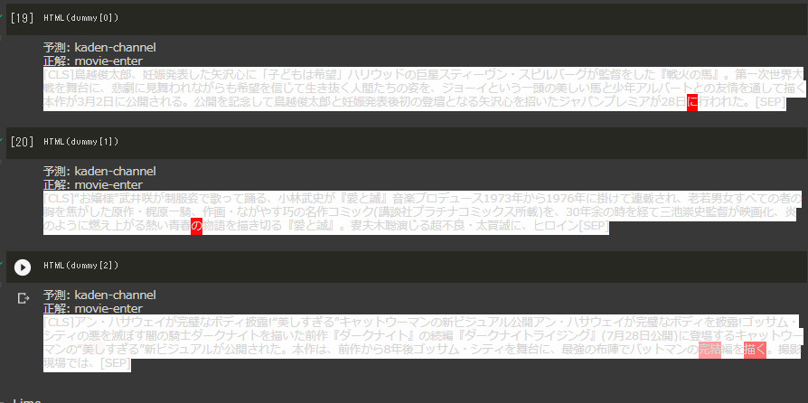
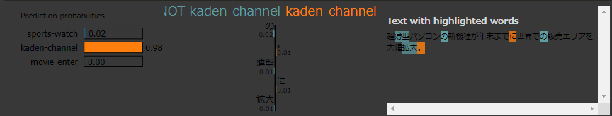

## Modelの解釈
**Encoder layer**  
手法: 単語埋め込み/Bidirectional-LSTM  
目的: 単語埋め込みを行いつつ、双方向からの全てのトークンの隠れ層出力する。さらに、双方向側の最後の隠れ層による影響値を単語埋め込みベクトルに取り入れる。  
  

**self Attention layer**  
手法: アテンション層  
目的: 双方向隠れ層からトークンごとの関係性を確率に変換することで重みとする。これを入力に加えて分類サイズを出力する。  

**Attentionによる可視化**  
トークン同士の関係性(token * token)を一本のベクトルにまとめたもの。(batch, 1, tokne)  
つまり入力値に対する各トークン同士の関係を一つに集約しているといえる。  
  

**Limeによる説明性**  
ある文章を入力することで、それを基としていくつかのダミーデータを作成する。モデルから分類することで関係性を生成する。  
  